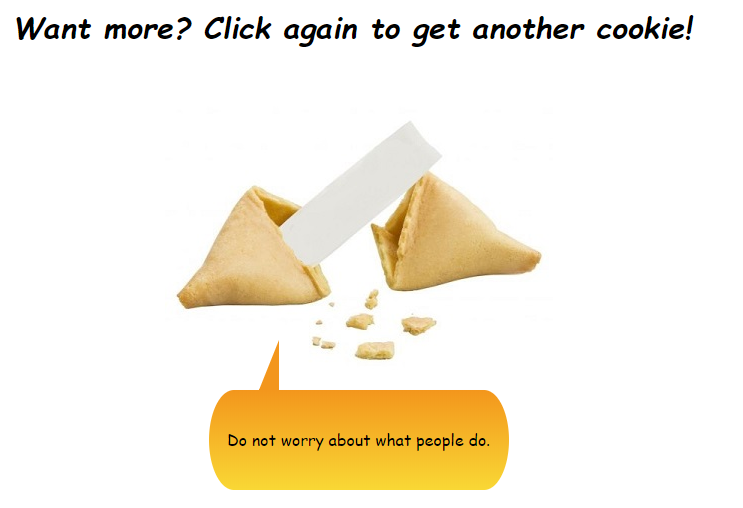

# AI that Generates Fortune Cookie Messages



Play with it here: 
??

Image courtesy: 
https://www.glueckskekse.de/
http://www.beyondmenu.com/


## Introduction

A [ULMFiT](https://arxiv.org/abs/1801.06146) model is trained to generate fortune cookie messages. The dataset is scraped from "[Fortune Cookie Message Archive](http://www.fortunecookiemessage.com/archive.php)". This dataset is pretty small due to the limited the online sources for fortune cookie messages. However, with the power of transfer learning and UMLFit, the model is able to generate fortune cookie style messages after only a few epochs of training. 

`/model/get_data.ipynb`: web scraping code. 
`/model/model.ipynb`: model training code. 

## Usage

The app is deployed on: 
??

To play with it on local server, install the requirements: 

```
pip install -r requirements.txt
```

Under the `/cookie/` folder, start the server: 

```
python app/server.py serve
```

Open your browser and visit the website: 

`http://localhost:5042`
